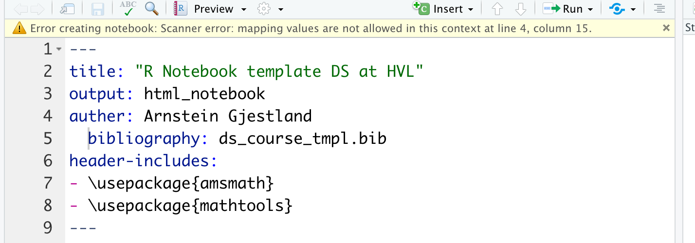
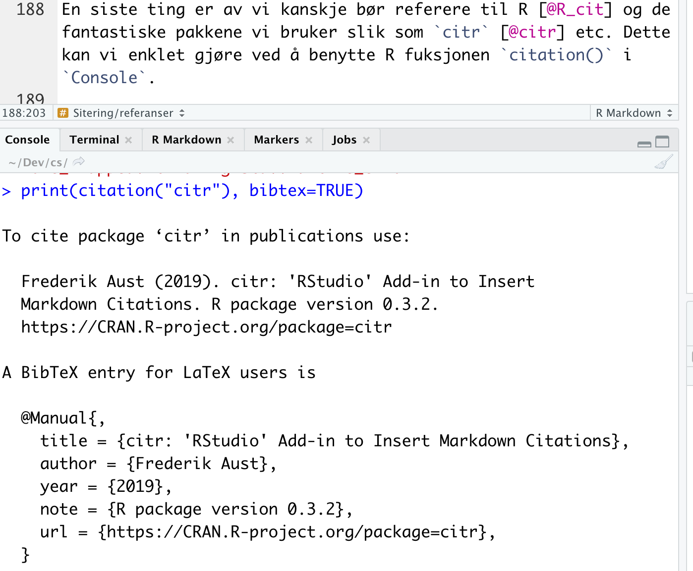

    ---
    title: "R Notebook template DS at HVL"
    bibliography: ds_course_tmpl.bib
    csl: springer-basic-author-date.csl
    header-includes:
    - \usepackage{amsmath}
    - \usepackage{mathtools}
    output:
      html_notebook: default
      pdf_document:
        latex_engine: xelatex
        citation_package: natbib
    auther: Arnstein Gjestland
    fig_caption: true
    ---

bhjggasdHJKDSA KHjsdhkjdsjkh

Det en ser ovenfor her er den såkalte YAML headeren til documentet.
Den bestemmer bl.a.
hvilket format vi vil ha `RMarkdown` dokumentet konvertert til.
Her settes også navnet på `Bibliography`filen vi vil benytte.
Den inneholder vår samling av referanser.
Bare de referansene vi siterer i teksten vil bli lagt til referanselisten.
RStudio vil selv endre litt i YAML, spesielt gjelder dette `output:` verdien som blir endret hvis vi velger et annet format i `Preview`menyen.

```{r setup, echo=FALSE}
library(pander)
```

```{r lm_output}
my_mod <- lm(dist ~ speed, data = cars)
summary(my_mod)
pander(my_mod)
pander(summary(my_mod))
```

```{r}
cars[1:10,]
pander(cars[1:10,])
pander(density(runif(10)))
```

```{r warning = FALSE}
chisq.test(table(mtcars$am, mtcars$gear))
pander(chisq.test(table(mtcars$am, mtcars$gear)))
```

Vi starter med en RMarkdown notebook og vil til slutt konvertere den til andre formater.

## Vivamus sagittis lacus vel augue laoreet rutrum faucibus. (Second level header)

Plura mihi bona sunt, inclinet, amari petere vellent.
Idque Caesaris facere voluntate liceret: sese habere.
Etiam habebis sem dicantur magna mollis euismod.
Quid securi etiam tamquam eu fugiat nulla pariatur.

### Formatering av tekst

Overskriften ovenfor er satt vha.
`### Formatering av tekst` på en egen linje (blank linje før og etter) og er tredje nivå.

*Kursiv* settes vha.
`*Kursiv*` og **uthevet** skrift vha.
`**uthevet**`.
Hevet tekst får vi vha.
`^` (f.eks. x^2^ er `x^2^`), mens senket tekst får vi ved `~` gjerne kalt «tilde» (f.eks. y~2~ er `y~2~`).
Ønsker vi å skrive `Markdown` kode som *ikke* skal evelures setter vi den mellom to \`, f.eks \``x^2^`\`.
Det siste bruker jeg mye av i dette dokumentet.
Ofte er \` en såkalt «dead letter», den er brukt til å sette merke på bokstaver, så vi trenger en `space` etter den siste.

#### Liste

Overskriften ovenfor er satt vha.
`#### Liste` på en egen linje (blank linje før og etter) og er fjerde nivå.

##### Uordnete lister

Dette er et eksempel på overskrift på femte og laveste nivå.
Den er satt vha.
`##### Uordnet liste med underliste` på en egen linje (blank linje før og etter).

Her er «Space»/Mellomrom angitt som «·».
Punkter på første nivå i en liste starter med -Space altså `-·`, mens andre nivå starter med `··*·` (altså SpaceSpace\*Space).
Tredje nivå starter med SpaceSpaceSpaceSpace-Space altså `····-·` osv..

##### Ordnete lister

Ordnete lister starter med tall), feks `1)` eller `8`.
Vi trenger ikke holde orden på nummerene, men det første vil være hvor nummereringen starter.

##### Eksempel på lister

-   Quae vero Fictum, deserunt mollit anim laborum astutumque!

-   auctorem tractata ab fiducia dicuntur.

    -   Quisque placerat facilisis

    -   egestas cillum

        -   dolore.

-   Tu quoque, Brute,

    1)  ordnet underliste
    2)  trenger ikke holde styr på nummer
    3)  som vi ser
    4)  men første angir tallet listen begynner på

-   Fili mi, nihil timor populi, nihil!

    12) purus
    13) sit
    14) amet
    15) fermentum

Listen ovenfor er satt vha.

    - Quae vero Fictum, deserunt mollit anim laborum astutumque!
    - auctorem tractata ab fiducia dicuntur.
      * Quisque placerat facilisis 
      * egestas cillum 
        - dolore.
    - Tu quoque, Brute, 
      1) ordnet underliste
      1) trenger ikke holde styr på nummer
      1) som vi ser
      1) men første angir tallet listen begynner på
    - Fili mi, nihil timor populi, nihil!
      12) purus 
      12) sit 
      12) amet 
      13) fermentum

1)  Cras mattis iudicium purus sit amet fermentum.

2)  Nihil hic munitissimus habendi senatus locus, nihil horum?

    1)  At nos hinc posthac,
    2)  sitientis piros Afros.

3)  Integer legentibus erat a ante historiarum dapibus.

4)  Sed haec quis possit intrepidus aestimare tellus.

    7)  Tityre, tu patulae recubans sub tegmine fagi dolor.
    8)  Idque Caesaris facere voluntate liceret: sese habere.

Listen over er satt vha.

    1) Cras mattis iudicium purus sit amet fermentum.
    1) Nihil hic munitissimus habendi senatus locus, nihil horum?
        1) At nos hinc posthac,
        2) sitientis piros Afros.
    1) Integer legentibus erat a ante historiarum dapibus.
    1) Sed haec quis possit intrepidus aestimare tellus.
          7) Tityre, tu patulae recubans sub tegmine fagi dolor.
          7) Idque Caesaris facere voluntate liceret: sese habere.

Når vi vil angi Markdown kode over flere linjer benytter vi \`\`\` på egen linje før og etter koden.
Se i kildekode filen (.Rmd filen) for eksempler på dette.

#### R code

Vi kan også sette R kode i dokumentet vårt.
Da starter vi med \`\`\`{r} på egen linje og avslutter med \`\`\` på egen linje.
Nedenfor er et eksempel på litt R kode som er riktig, men med dårlig stil

```` ```{r} x=c(10,20,30) y=c(0.5,0.3,0.7) plot(x,y) ```` \`\`\`

Benytter vi «Styler» (marker koden og velg `Style selection` fra `Addins` menyen) kan vi få den tilpasset til `tidyverse` stil.
Siden vi er i en såkalt «Notebook» må vi trykke på trekanten til høyre for å se resultatet.

```{r}
x <- c(10, 20, 30)
y <- c(0.5, 0.3, 0.7)
plot(x, y)
```

#### Matematikk

For å skrive matematikk i RMarkdown benytter man LaTeX [@lamport1986] som er en makropakke bygget fra TeX [@knuth1986texbook] for å skrive strukturerte documenter.
Når vi genererer pdf filer fra RMarkdown går vi også via LaTeX.
Vi skriver matematikk i teksten vha.
`$ $`, f.eks.
$r_m = \sum_{i=1}^N w_i \cdot \bar{r}_i$ vha.
`$r_m = \sum_{i=1}^N w_i \cdot \bar{r}_i$`.
Ønsker vi å sette dette som et uttrykk på egen linje benytter vi `$$ $$` med blank linje før og etter

$$
r_m = \sum_{i=1}^N w_i \cdot \bar{r}_i, \quad
\beta_m = \sum_{i=1}^N w_i \cdot \beta_i
$$

Dette er satt vha.
markup koden

    $$
    r_m = \sum_{i=1}^N w_i \cdot \bar{r}_i \quad, \beta_m = \sum_{i=1}^N w_i \cdot \beta_i
    $$

Ønsker vi likninger over flere linjer kan vi bruke

    \begin{math}
    \begin{aligned}
    a^2 + b^2 &= c^2 \\ &= 5
    \end{aligned}
    \end{math}

som gir oss

```{=tex}
\begin{math}
\begin{aligned}
a^2 + b^2 &= c^2 \\ &= 5
\end{aligned}
\end{math}
```
`\begin{aligned}` kommer fra en ekstra-pakke til \$\LaTeX \$ kalt `amsmath` som gir oss muligheter utover standard \$\LaTeX \$ matte.
Vi lastet `amsmath` i YAML-headeren i starten av dokumentet.

```{r, include=FALSE}
options(tinytex.verbose = TRUE)
```

Vi kan også få til matte over flere linjer vha.
standard \$\LaTeX \$.
Nummererte får vi vha.
`eqnarray`.
F.eks vil

    \begin{eqnarray}
    r_m &=& \sum_{i=1}^N w_i \cdot \bar{r}_i, \\
    \beta_m &=& \sum_{i=1}^N w_i \cdot \beta_i
    \end{eqnarray}

gi oss

```{=tex}
\begin{eqnarray}
r_m &=& \sum_{i=1}^N w_i \cdot \bar{r}_i, \\
\beta_m &=& \sum_{i=1}^N w_i \cdot \beta_i
\end{eqnarray}
```
Ønsker vi ikke nummerering kan vi benyttet `eqnarray*` f.eks

    \begin{eqnarray*}
    r_m &=& \sum_{i=1}^N w_i \cdot \bar{r}_i, \\
    \beta_m &=& \sum_{i=1}^N w_i \cdot \beta_i
    \end{eqnarray*}

som gir

```{=tex}
\begin{eqnarray*}
r_m &=& \sum_{i=1}^N w_i \cdot \bar{r}_i, \\
\beta_m &=& \sum_{i=1}^N w_i \cdot \beta_i
\end{eqnarray*}
```
Et tredje alternativ er å benytte `eqnarray` og så slå av nummerering på enkelte linjer vha.
`\nonumber`

    \begin{eqnarray}
    r_m &=& \sum_{i=1}^N w_i \cdot \bar{r}_i, \\
    \beta_m &=& \sum_{i=1}^N w_i \cdot \beta_i \nonumber
    \end{eqnarray}

som gir

```{=tex}
\begin{eqnarray}
r_m &=& \sum_{i=1}^N w_i \cdot \bar{r}_i, \\
\beta_m &=& \sum_{i=1}^N w_i \cdot \beta_i \nonumber
\end{eqnarray}
```
Som vi ser ovenfor benytter vi `\\` for å angi ny linje (eller riktigere: slutten ppå en linje).
Vær veldig nøye med `&` tegnene.
Ellers blir det mye krøll.

Her er et eksempel ~~sjålet~~ lånt fra [Wikibooks LaTeX/Mathematics](https://en.wikibooks.org/wiki/LaTeX/Mathematics#cite_note-amsmath-3) som er et greit sted for å finne mer om å skrive matematikk vha.
\$\LaTeX \$.
Det siste eksemplet benytter også `amsmath` (`\cfrac` er definert der) som gir oss flere muligheter.

$$
x = a_0 + \cfrac{1}{a_1 
          + \cfrac{1}{a_2 
          + \cfrac{1}{a_3 + \cfrac{1}{a_4} } } }
$$

#### Sitering/referanser

Siteringer skjer i markdown vha.
`[@citekey]`, f.eks.
`[@knuth1986texbook]` som jeg brukte for å sitere TeX boken ovenfor.
Citekey bestemmer vi i utgangspunktet selv, event.
mha.
Zotero, men det kan være greit å ha et system.
Pakken `citr` vil installere en Addin i RStudio som gjør det lettere å legge inn siteringer.
Opplysningene som skal i referanselisten hentes inn fra filen som vi anga oppe i YAML headeren, `bibliography: ds_course_tmpl.bib`.
Det er veldig viktig at denne ligger på øverste nivå, dvs det må ikke være noe «whitespace» før `bibliography`.
Ellers får vi en «Error»

<center>

{width="70%"}

</center>

Informasjon til referanselisten hentes fra bib-filen, her `ds_cource_tmpl.bib`.
For TeX boken er dette

    @book{knuth1986texbook,
      title = {The {{TeXbook}}},
      author = {Knuth, D.E.},
      year = {1986},
      publisher = {{Addison-Wesley}},
      isbn = {978-0-201-13447-6},
      lccn = {85030845},
      series = {Computers \& Typesetting}
    }

Dette er ingen fornøyelse å skrive inn selv (tro meg, jeg har gjort det) så heldigvis har vi nå verktøy som gjør at vi lett kan ~~stjele~~ hente opplysningene fra andre f.eks.
Oria (Bibsys) eller andre nettarkiv (se eget dok. om Zotero).

Systemet fungerer slik at bare det vi referer i teksten blir tatt inn i referanselisten.
Bib-filen kan altså inneholde mange flere kilder en de vi bruker.
Hvordan siteringene ser ut og hvordan referanselisten er formatert bestemmes av en såkalt `csl` fil (kan hentes fra [Zotero Style Repository](https://www.zotero.org/styles)).
Denne legges helst i samme mappe som vårt dokument og må angis i YAML headeren.

Vi har også tre ulike varianter av cite kommandoen som vi skifter mellom alt etter hvordan vi siterer.
Disse er [@knuth1986texbook] vha.
kommandoen `[@knuth1986texbook]`, [-@knuth1986texbook] vha.
kommandoen `[-@knuth1986texbook]` og @knuth1986texbook vha.
kommandoen `@knuth1986texbook`.

En siste ting er av vi kanskje bør referere til R [@R_cit] og de fantastiske pakkene vi bruker slik som `citr` [@citr] etc.
Dette kan vi enklet gjøre ved å benytte R fuksjonen `citation()` i `Console`.

<center>

{width="70%"}

*Fig. 1: Bruk av `citation()` funksjonen in Console. `@Manual{}` etc. må kopieres inn i bib-filen. I `citr` må en så klikke på det tomme området under tabellen for å få mulighet til å lese in den oppdaterte bib-filen.*

</center>

Merk at RMarkdown ikke har direkte støtte for å sette en forklaring («caption») på figurene.
Se gjerne .Rmd filen for å se hvordan jeg har trikset det til her.

Etter å ha gjort tilsvarende for `knitr` [@cit_knitr] (husk å legge inn cite-key før første komma i bib-filen. Jeg valgte å bruke `cit_knitr`.).

    @InCollection{cit_knitr,
        booktitle = {Implementing Reproducible Computational Research},
        editor = {Victoria Stodden and Friedrich Leisch and Roger D. Peng},
        title = {kn

Jeg har også benyttet pakkene `RMarkdown` [@cit_rmarkdown] og `styler` [@cit_styler].

Foreløpig har vi bare generert html-dokumenter, men mye av poenget med `RMarkdown` er at vi lett skal kunne generere dokumentet i ulike format.
Bruk Knit/Preview menyen og generer pdf og MS Word versjoner.

# Referanser
